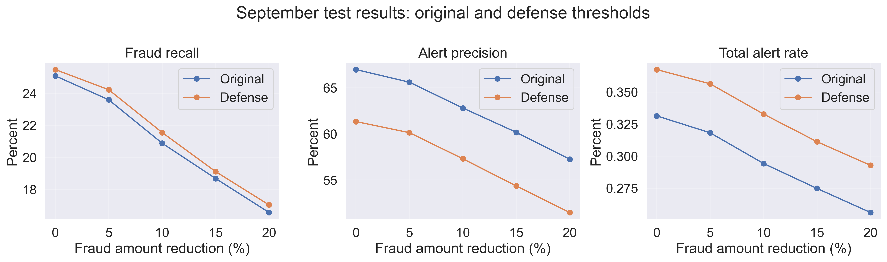

# Adversarial fraud risk

An exploratory study of fraud-model sensitivity to transaction amount changes and detection-threshold tradeoffs.

**Author:** Muhammad Salman Shamsi  
**Status:** Completed initial experiment. Not peer reviewed.  
**Data:** Synthetic transactions only. No client POS records are included.

## Research question
Can reductions in fraudulent transaction amounts cause a behavioral fraud model to stop flagging those transactions? Can a lower detection threshold recover detections at an acceptable alert workload?

## Main findings
At the original threshold of **0.145**, the September evaluation set contained **287,873 transactions**, including **2,547 fraud cases**. The model initially detected **639 fraud cases** with **315 false alerts**.

| Fraud amount reduction | Detected fraud | Evasion among originally detected fraud | Recall |
|---|---:|---:|---:|
| 0% | 639 | 0.00% | 25.09% |
| 5% | 601 | 5.95% | 23.60% |
| 10% | 532 | 16.74% | 20.89% |
| 15% | 476 | 25.51% | 18.69% |
| 20% | 422 | 33.96% | 16.57% |

The lower threshold, **0.14035087719298245**, detected **434 fraud cases** under the 20% attack, compared with 422 at the original threshold. It added **94 false alerts**, increasing them from 315 to 409. Recall increased by 0.47 percentage points, while precision fell from 57.26% to 51.48%. This experiment shows limited protection from threshold adjustment and a higher investigation workload.



## Method
- Training: April–July 2018 (1,169,723 rows).
- Validation: August 2018 (296,559 rows).
- Evaluation: September 2018 (287,873 rows).
- Model: standardized logistic regression with balanced class weights, followed by isotonic calibration on August data.
- Features: amount, hour, weekday, month, prior customer transaction count, amount deviation from prior customer mean, and prior terminal transaction count.
- Experiment: independently reduce fraudulent amounts by 5%, 10%, 15% or 20%, recalculate amount deviation, and preserve historical features and legitimate transactions.
- Defense: select a lower threshold on 20%-reduced validation data, maximizing F1 under a budget of twice the original clean-validation alerts.

Attack success counts evasion among originally detected fraud. Recall counts detected fraud among all 2,547 fraud cases. These denominators differ.

## Files
- [Public workflow notebook](notebooks/research_workflow.ipynb)
- [Research report](reports/research_report.md)
- [Final comparison table](results/final_attack_defense_comparison.csv)
- [Experiment metadata](results/experiment_metadata.json)
- [Source attribution](ATTRIBUTION.md)

## Reproduce
Use Python 3.10 or 3.11 in a dedicated environment. From the repository root:

```bash
python -m venv .venv
```

Activate the environment using the command for your operating system, then:

```bash
python -m pip install -r requirements.txt
python -m notebook
```

Open `notebooks/research_workflow.ipynb` and run cells in order. The workflow loads a complete local `data/simulated-data-raw` directory if available. Otherwise it regenerates the simulation in memory. Generation and model fitting can take several minutes and need enough memory for 1.75 million rows. New outputs go to `results/reproduced`.

The supplied learning notebook produced the published results. The consolidated public workflow has undergone syntax and content checks, but has not yet been independently executed end to end. Do not interpret consolidation as independent replication. Dependency versions not recorded in the original metadata use compatibility ranges.

## Limitations
The study uses simulated data, one model family and fixed historical context. Fraud labels remain unchanged after amount reductions, and attacker incentives are not modeled. Modified transactions do not update future histories. Same-time transactions assume retained sequential row order.

The original study selected the calibration method after comparing September results, so September was not a fully untouched model-selection holdout. August labels were reused for calibration fitting and threshold selection. The defense was selected for a specific 20% attack. Results describe this exploratory experiment rather than established deployment performance or loss recovery.

## Attribution and license
The synthetic transaction generator derives from the [Fraud Detection Handbook](https://github.com/Fraud-Detection-Handbook/fraud-detection-handbook) by Le Borgne, Siblini, Lebichot and Bontempi (2022). The upstream notebook code uses GNU GPL v3. See [ATTRIBUTION.md](ATTRIBUTION.md) and [LICENSE](LICENSE). This repository credits the generator separately from the project analysis.
